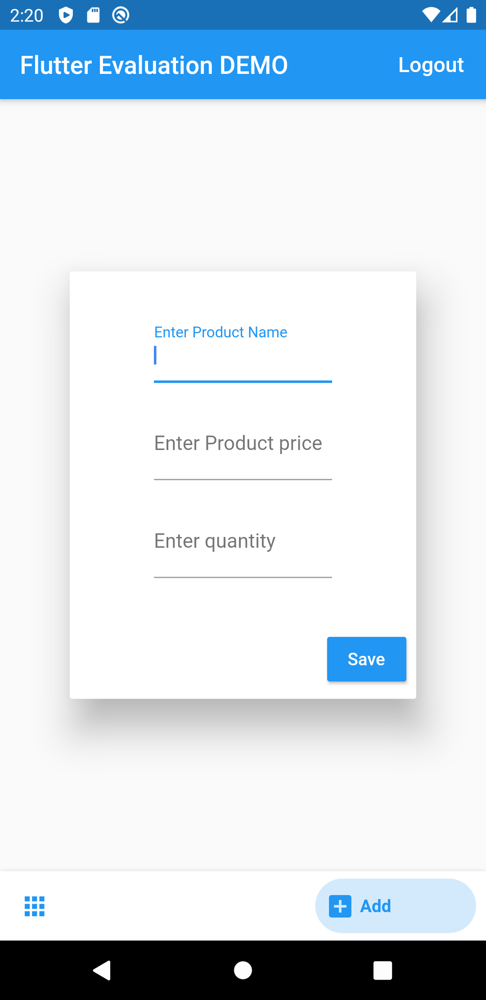
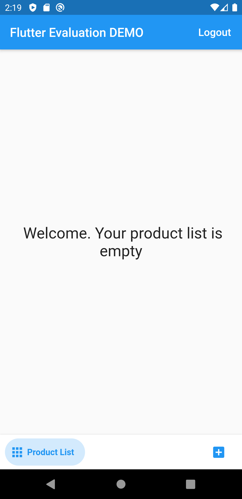
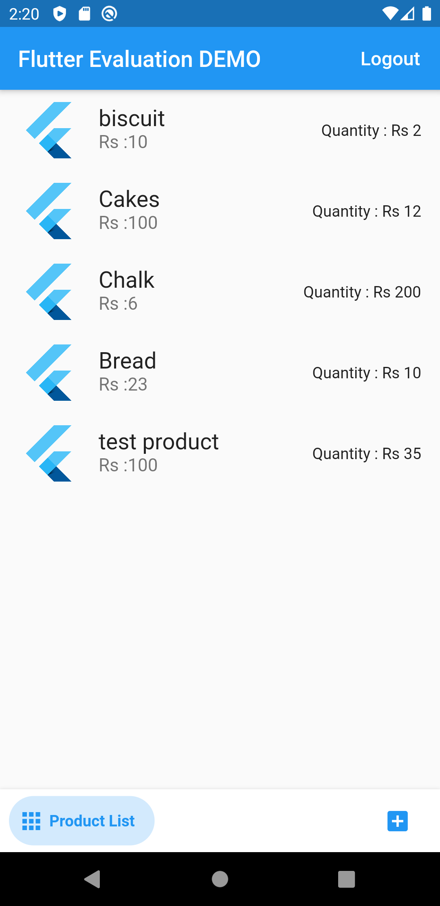
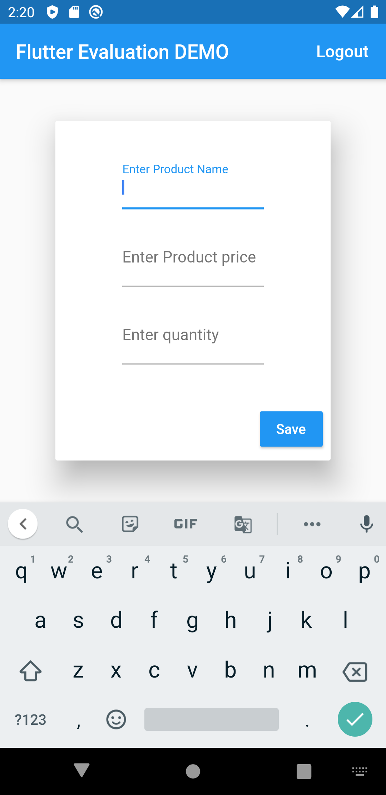

# Ecommerce_With_Flutter_Firebase

A sample Flutter project to show case user login and signup process with Firebase authentication.
It also shows how to perform CRUD operations with Firebase Real Time Database using simple Products list application.

# Preview of Android
{:height="400px" width="200px"}
{:height="400px" width="200px"}
{:height="400px" width="200px"}
{:height="400px" width="200px"}

You can build yourself a ios app with the source code provided

For help getting started with Flutter, view our online
[documentation](https://flutter.io/).
